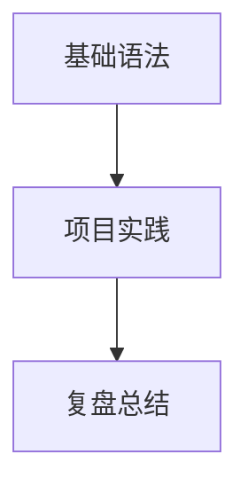

# Gin Blog

Gin 的个人技术博客。文章内容来自 `docs/` 目录下的 MDX 文件，可以按 `frontend`、`python`、`java`、`agent`、`database`、`other` 等主题继续细分。

## 技术栈

- Next.js App Router、React、TypeScript
- Tailwind CSS、shadcn/ui、Motion
- next-mdx-remote、remark-gfm、remark-math、rehype-katex
- Mermaid、Shiki、Recharts
- pnpm

## 本地运行

需要 Node.js 22 和 pnpm 11。

```bash
pnpm install
pnpm dev
```

浏览器打开 [http://localhost:3000](http://localhost:3000)。

## 添加文章

在 `docs/` 或任意子目录中新建 `.mdx` 文件，并填写 frontmatter：

```mdx
---
title: '文章标题'
description: '文章描述'
category: '前端'
tags: 'React,Next.js'
date: '2026-08-11'
readTime: '8 分钟'
author: 'Gin'
---
```

文件名会生成文章 slug。首页分类、文章详情、目录和相邻文章会自动生成。

## MDX 能力

### 表格

```mdx
| 技术 | 用途 |
| --- | --- |
| Next.js | 页面与路由 |
| MDX | 内容渲染 |
```

### LaTeX

行内公式使用 `$E = mc^2$`，块级公式使用：

```mdx
$$
E = mc^2
$$
```

### Mermaid 流程图

````mdx

````

页面中的 Mermaid 图表支持滚轮缩放、按钮缩放、拖拽平移和复位。

### Callout 提示块

```mdx
<Callout type="interview" title="面试重点">
闭包常考作用域链、变量生命周期和内存泄漏。
</Callout>
```

`type` 支持 `note`、`tip`、`warning`、`danger`、`interview`。

### 代码块

````mdx
```ts title="useCounter.ts" showLineNumbers {2}
const count = 0
const next = count + 1
```
````

支持文件名、复制按钮、行号、指定行高亮和 Shiki 语法高亮。

### Tabs

```mdx
<Tabs defaultValue="react">
  <TabsList>
    <TabsTrigger value="react">React</TabsTrigger>
    <TabsTrigger value="vue">Vue</TabsTrigger>
  </TabsList>
  <TabsContent value="react">React 示例内容</TabsContent>
  <TabsContent value="vue">Vue 示例内容</TabsContent>
</Tabs>
```

### 图表

```mdx
<BarChartBlock
  title="学习投入"
  data={[
    { name: "前端", value: 80 },
    { name: "Python", value: 65 },
    { name: "Agent", value: 72 }
  ]}
/>
```

也可以使用 `<LineChartBlock />`、`<AreaChartBlock />`，或 `<ChartBlock type="bar" />`。

### 文件树

```mdx
<FileTree
  rootLabel="my_blog"
  tree={[
    "src/app/page.tsx",
    "src/components/post-explorer.tsx",
    "docs/frontend/javascript-core.mdx"
  ]}
/>
```

### 步骤块

```mdx
<Steps>
  <Step title="安装依赖">运行 `pnpm install`。</Step>
  <Step title="启动项目">运行 `pnpm dev`。</Step>
</Steps>
```

### 折叠内容

```mdx
<Details title="展开查看答案">
这里可以放解析、代码或补充资料。
</Details>
```

## 检查

```bash
pnpm lint
pnpm build
pnpm build:static
```

## 部署

海外生产地址：[https://xygin.vercel.app](https://xygin.vercel.app)

国内访问地址：[https://gin-blog-gin-d0ghqbprg7d3819db.webapps.tcloudbase.com](https://gin-blog-gin-d0ghqbprg7d3819db.webapps.tcloudbase.com)

项目支持静态导出：

```bash
pnpm build:static
```

构建产物位于 `out/` 目录。推送到 `main` 分支后，Vercel 和 CloudBase 会按已配置的 CI/CD 流程自动部署。
